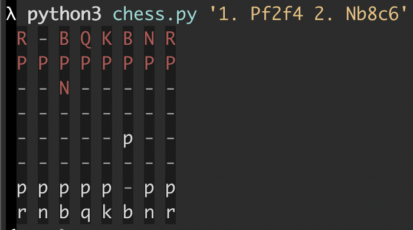

# acnab

A Python script for rendering an ascii chessboard using abbreviated algebraic chess notation. The original `chess.py` has been forked into the `web` directory and output updated for HTML and interpolated by PHP. At this point it's an experiment and may or may not be merged together.

# Usage

```
python3 chess.py '1. Pf2f4 2. Nb8c6'
```

or open `web/index.php` in a browser with PHP enabled on the server. PHP7+

# Screenshot

ASCII board



HTML board


