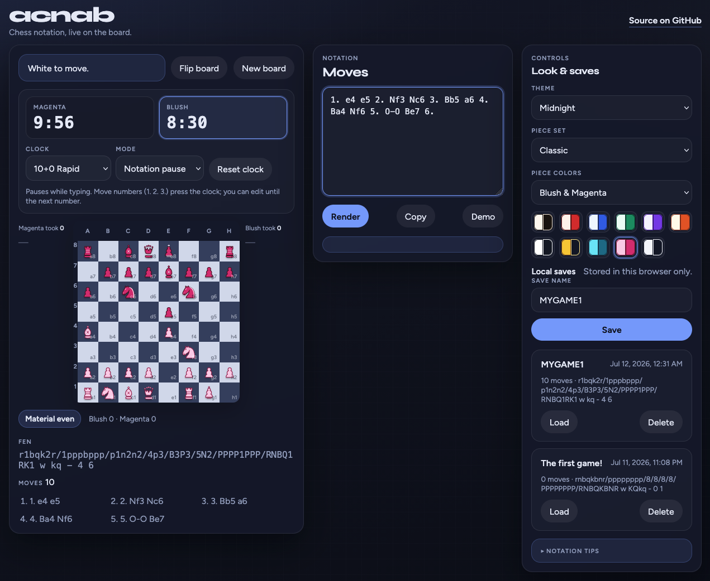

# acnab

[](https://wsams.github.io/acnab/web/)

**acnab** renders chess positions from standard chess notation in the terminal and in the browser.

**Play it free right now:** [wsams.github.io/acnab/web](https://wsams.github.io/acnab/web/) — no install, no account. Type SAN/PGN moves and watch the board update live. Optional **CPU player** (Stockfish in the browser) can be toggled on for a real game after a coin toss for White.



The browser UI shows the live board beside a Moves panel: type SAN/PGN, hit **Render**, and the position updates with FEN, material, and move history. Dual clocks, theme/piece-color presets, and browser-local saves sit alongside the board for over-the-board notation tracking. Turn on **CPU player** to face Stockfish at a chosen strength — input stays chess notation.

## CLI usage

Render a game directly:

```bash
python3 chess.py --moves '1. e4 e5 2. Nf3 Nc6 3. Bb5 a6'
```

Use stdin when quoting is inconvenient in bash or fish:

```bash
printf '1. d4 d5 2. c4' | python3 chess.py --moves-file -
```

Print shell completion helpers:

```bash
python3 chess.py --print-completion bash
python3 chess.py --print-completion fish
```

Save and reload games locally:

```bash
python3 chess.py --moves '1. e4 e5 2. Nf3 Nc6' --save demo
python3 chess.py --load demo
python3 chess.py --list-games
```

### Supported notation

- Standard SAN/PGN style moves such as `e4`, `Nf3`, `Qxd5+`, `O-O`, and `c8=Q#`
- Legacy coordinate-style moves such as `Pf2f4` and `Nb8c6`

## Web usage

### Free on GitHub Pages

Open **[https://wsams.github.io/acnab/web/](https://wsams.github.io/acnab/web/)** to play in the browser for free.

GitHub Pages publishes the static UI from `web/` (the site root redirects there). The build is fully static and client-side:

- live board updates while typing
- localStorage drafts and named saves
- theme, SVG piece-set, and piece-color switching plus FEN/status summaries
- flip board for couch co-op
- optional CPU opponent (Stockfish.js 18 WASM, skill/Elo presets) — off by default; coin toss for who plays White
- no CDN runtime dependency for the chess engine (Stockfish is vendored under `web/vendor/stockfish/`, GPLv3)

### Local static preview

```bash
python3 -m http.server 8080 --directory web
```

Then open `http://localhost:8080/`.

### Optional PHP + Python API

Serve `web/` with PHP if you want the optional `POST` render endpoint that shells out to `chess.py`. Opening `web/index.php` still serves the same client-side UI.

## Development notes

Install Python dependencies and run the lightweight checks:

```bash
python3 -m pip install -r requirements.txt
python3 -m unittest discover -s tests
python3 -m py_compile chess.py web/chess.py acnab_core.py
php -l web/index.php
```

Install Node release tooling (used by CI):

```bash
npm clean-install
```

Build the GitHub Pages artifact locally:

```bash
npm run build:pages
```

### Releases

Pushes to `master` run [semantic-release](https://semantic-release.gitbook.io/) via `.github/workflows/release.yml` (direct `npx semantic-release`, no third-party release action). GitHub Pages publishes from the `master` branch (legacy); `.github/workflows/pages.yml` verifies `npm run build:pages` still produces a clean `_site/` artifact.
