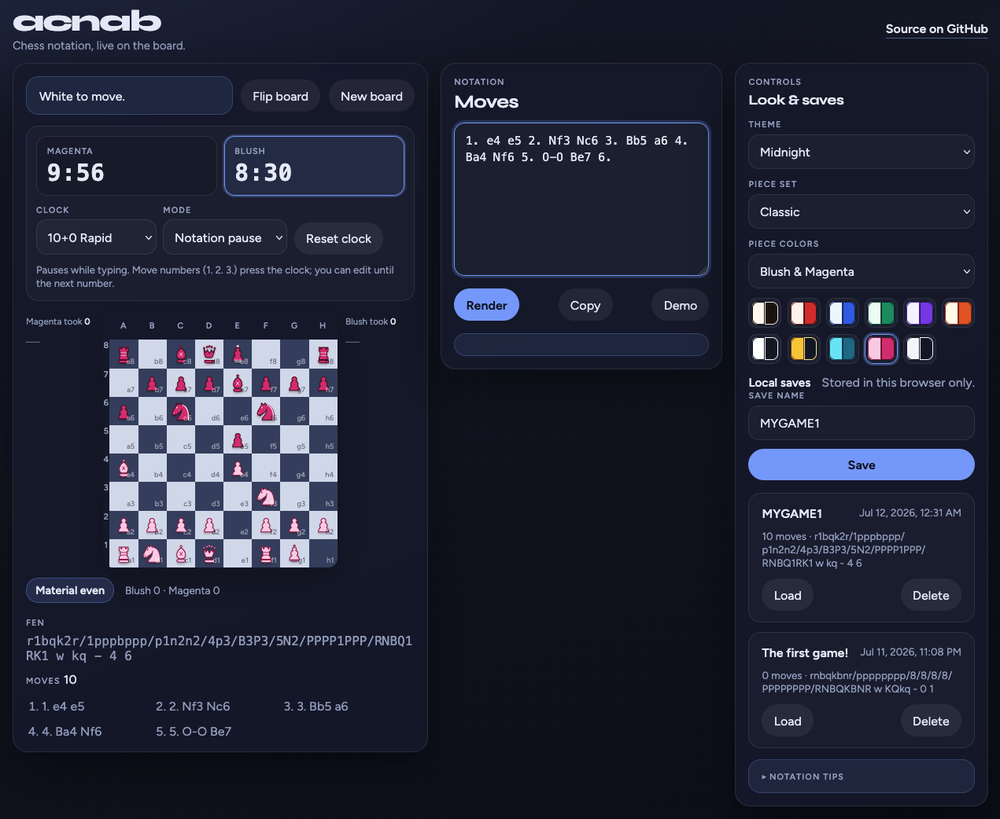

# acnab

[](https://wsams.github.io/acnab/web/)

**Play chess right on GitHub. Take lessons free.** No install, no account, no ads, no tracking.

Open **[wsams.github.io/acnab/web](https://wsams.github.io/acnab/web/)** and the board is already there. Type SAN/PGN, or click pieces. Turn on **Lessons** when you want a coach. The page is static: notation, saves, the CPU, and the coach all stay in your browser.

**acnab** renders chess positions from standard chess notation in the terminal and in the browser.



The browser UI shows the live board beside a Moves panel: type SAN/PGN, hit **Render**, and the position updates with FEN, material, and move history. Dual clocks, theme/piece-color presets, and browser-local saves sit alongside the board. Turn on **CPU player** to face Stockfish at a chosen strength. Turn on **Lessons** for a second engine that never moves a piece: it explains candidate moves in chess language and lets you preview a line before you commit. Type SAN, or use **Click to move**.

## Play free, and take a lesson

The whole app is published on GitHub Pages from this repository. You do not download a client, create an account, or sit through an ad.

- **Play:** [https://wsams.github.io/acnab/web/](https://wsams.github.io/acnab/web/)
- **Lessons:** in that same page, press **Lessons**. The coach is off until you ask for it.
- **Privacy:** acnab does not include analytics, accounts, or ads. Games and the lesson setting are stored in your browser only. Stockfish is vendored under `web/vendor/stockfish/` (GPLv3) and runs locally.

### What the coach does

Lessons are a second Stockfish. It thinks about the same position as you and, when a CPU opponent is on, about the same position as that CPU. It does not play a move.

- It offers a few tries, scored from White’s side of the evaluation, and says whether each one is the first choice, a sound alternative, or a concession.
- The write-up uses real chess ideas it can actually see on the board: development, the center, king safety, absolute and relative pins, forks, discovered check, skewers, outposts, passed pawns, pawn breaks, open files, prophylaxis, and opposition. A Ruy Lopez bishop is described as pressure, not a pin, while the d-pawn still blocks the king.
- **Preview line** steps through the coach’s continuation on the board. **Watch** plays that line forward. Nothing is written into the notation.
- **Play** commits just that one move, the same way a click or a typed SAN would. You can ignore the suggestions and move however you like.
- After your move, the coach says whether it was the move it wanted. After the CPU replies, it compares that reply with the line it expected, then reads the new position for your next try.
- **Glance**, **Study**, and **Master class** change how long the coach thinks. Study is the default.

The CPU opponent is separate. Its strength is still the level you pick. The coach stays full-strength so a weaker CPU can be compared with the try a stronger player would choose.

## CLI usage

Render a game directly:

```bash
python3 chess.py --moves '1. e4 e5 2. Nf3 Nc6 3. Bb5 a6'
```

Use stdin when quoting is inconvenient in bash or fish:

```bash
printf '1. d4 d5 2. c4' | python3 chess.py --moves-file -
```

Print shell completion helpers:

```bash
python3 chess.py --print-completion bash
python3 chess.py --print-completion fish
```

Save and reload games locally:

```bash
python3 chess.py --moves '1. e4 e5 2. Nf3 Nc6' --save demo
python3 chess.py --load demo
python3 chess.py --list-games
```

### Supported notation

- Standard SAN/PGN style moves such as `e4`, `Nf3`, `Qxd5+`, `O-O`, and `c8=Q#`
- Legacy coordinate-style moves such as `Pf2f4` and `Nb8c6`

## Web usage

### Free on GitHub Pages

Open **[https://wsams.github.io/acnab/web/](https://wsams.github.io/acnab/web/)** to play in the browser for free, and to start a lesson whenever you want one. No account, no ads, no tracking.

GitHub Pages publishes the static UI from `web/` (the site root redirects there). The build is fully static and client-side:

- live board updates while typing
- localStorage drafts and named saves
- theme, SVG piece-set, and piece-color switching plus FEN/status summaries
- flip board for couch co-op
- shareable board links (notation encoded in the URL hash; opening a link resets to the start and autoplays)
- play controls to step through or autoplay a game with a gliding piece animation
- click to lift a piece and click to place it; the moves box fills in SAN as each move lands
- optional CPU opponent (Stockfish.js 18 lite WASM) — off by default; coin toss for who plays White. Limited levels use Stockfish’s UCI Elo scale (1320–2500). Beginner and Casual are approximate mixes below that floor.
- optional **Lessons** coach — off by default; a second, full-strength Stockfish that never moves. It explains candidate moves (pins, forks, outposts, pawn breaks, opposition, and the opening you just entered), lets you preview or watch the line, and only writes a move if you press Play. After your move and the CPU’s reply, it reads the new position.
- no CDN runtime dependency for the chess engine (Stockfish is vendored under `web/vendor/stockfish/`, GPLv3). The page does not load analytics or ads.

Example shared game (opens at move 1 and plays through to mate):
[Open the demo board](https://wsams.github.io/acnab/web/#g=MS4gZTQgYzUgMi4gTmYzIGQ2IDMuIGQ0IGN4ZDQgNC4gTnhkNCBiNSA1LiBCeGI1KyBCZDcgNi4gTmMzIGY1IDcuIGV4ZjUgZzYgOC4gUWYzIGd4ZjUgOS4gUWg1Iw)

### Local static preview

```bash
python3 -m http.server 8080 --directory web
```

Then open `http://localhost:8080/`.

### Optional PHP + Python API

Serve `web/` with PHP if you want the optional `POST` render endpoint that shells out to `chess.py`. Opening `web/index.php` still serves the same client-side UI.

## Development notes

Install Python dependencies and run the lightweight checks:

```bash
python3 -m pip install -r requirements.txt
python3 -m unittest discover -s tests
python3 -m py_compile chess.py web/chess.py acnab_core.py
php -l web/index.php
```

Install Node release tooling (used by CI):

```bash
npm clean-install
```

Build the GitHub Pages artifact locally:

```bash
npm run build:pages
```

### Releases

Pushes to `master` run [semantic-release](https://semantic-release.gitbook.io/) via `.github/workflows/release.yml` (direct `npx semantic-release`, no third-party release action). GitHub Pages publishes from the `master` branch (legacy); `.github/workflows/pages.yml` verifies `npm run build:pages` still produces a clean `_site/` artifact.
